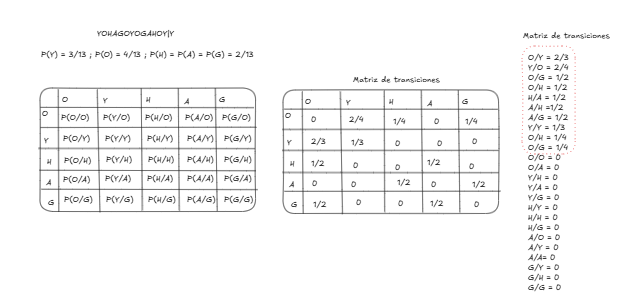
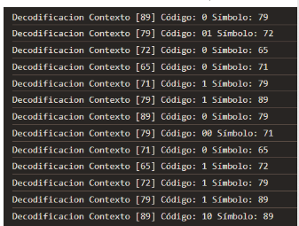
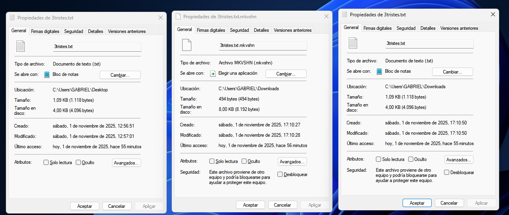

# Ejemplo de YOHAGOYOGAHOYY

## Markov grado 1 para la codificacion

## luego aplicamos Shannon

## Codificación

## Decodificación

### Propiedades de los archivos generados

YOHAGOYOGAHOYY

tres tristes tigres......

martin fierro

